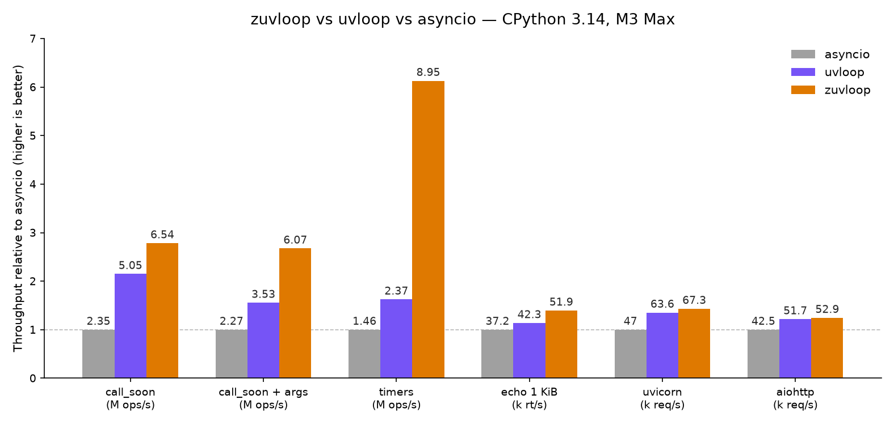

# zuvloop

<p align="center">
  <em>A fast, drop-in asyncio event loop, powered by libuv and written in Zig ⚡</em>
</p>

---

**Documentation**: <a href="https://zuvloop.marcelotryle.com" target="_blank">https://zuvloop.marcelotryle.com</a>

**Source Code**: <a href="https://github.com/Kludex/zuvloop" target="_blank">https://github.com/Kludex/zuvloop</a>

---

zuvloop is a replacement for the built-in `asyncio` event loop.

Your code stays the same. The loop underneath gets faster. 🚀

The key features are:

- **Fast**: Scheduling, timers, sockets, and DNS run in native code, driven by [libuv](https://libuv.org) — the same engine behind Node.js. Up to **6x faster than asyncio** on core loop operations and faster than [uvloop](https://github.com/MagicStack/uvloop) on 10 of the 11 benchmarks below.
- **Drop-in**: One line to switch. Everything is standard `asyncio` — same `Task` objects, same protocols, same APIs.
- **Fully typed**: Ships type hints for everything and passes **strict mypy**. Your editor will love it. ✨
- **Observable**: Built-in [OpenTelemetry](https://opentelemetry.io) instrumentation — slow-callback spans, unhandled-exception spans, loop metrics. Zero cost until you turn it on.
- **Modern**: Built for Python 3.14, including the new asyncio introspection tools (`python -m asyncio ps`, call graphs, and friends).

## Performance

<p align="center">
  
</p>

Throughput relative to stock asyncio (higher is better), measured with the suite in
`benchmarks/` on an M3 Max, macOS 26, CPython 3.14. The labels show the absolute numbers.

| Benchmark | asyncio | uvloop | zuvloop |
| --- | ---: | ---: | ---: |
| `call_soon` | 2.35M/s | 5.05M/s | **6.54M/s** |
| `call_soon` with arguments | 2.27M/s | 3.53M/s | **6.07M/s** |
| `call_soon_threadsafe` | 0.38M/s | 5.15M/s | **8.48M/s** |
| timer schedule + cancel | 1.46M/s | 2.37M/s | **8.95M/s** |
| bulk stream | 6.6 GiB/s | 6.9 GiB/s | **9.4 GiB/s** |
| echo round trips, 1 KiB | 37.2k/s | 42.3k/s | **51.9k/s** |
| uvicorn, plaintext | 47.0k req/s | 63.6k req/s | **67.3k req/s** |
| uvicorn, 10 KiB body | 44.5k req/s | 59.9k req/s | **64.3k req/s** |
| aiohttp server | 42.5k req/s | 51.7k req/s | **52.9k req/s** |
| aiohttp client | 9.49k req/s | **11.5k req/s** | 11.1k req/s |
| `getaddrinfo`, numeric host | 20.7k/s | 1.47M/s | **1.77M/s** |

Curious how? The [architecture docs](https://zuvloop.marcelotryle.com) explain the design:
argument storage inside handles (no tuple per callback), a native timer heap behind a single
`uv_timer_t`, per-turn vectored write batching, zero-copy reads, and a `getaddrinfo` fast path
for address literals.

## Requirements

- Python 3.14+
- Linux or macOS

## Installation

```console
$ pip install zuvloop
```

To build from source you also need [Zig](https://ziglang.org/download/) 0.16.

## Example

Write normal asyncio code, run it with zuvloop:

```python
import asyncio

import zuvloop


async def main() -> None:
    reader, writer = await asyncio.open_connection("example.com", 80)
    writer.write(b"GET / HTTP/1.0\r\nHost: example.com\r\n\r\n")
    await writer.drain()
    print(await reader.read(64))
    writer.close()
    await writer.wait_closed()


zuvloop.run(main())
```

Prefer to keep `asyncio.run()`? Hand it the loop factory:

```python
asyncio.run(main(), loop_factory=zuvloop.new_event_loop)
```

That's it. That's the migration. 🎉

## Observability

zuvloop emits plain OpenTelemetry. The only runtime dependency is `opentelemetry-api` — not the
SDK, nothing vendor-specific. Providers can be configured before the loop starts or from inside
it — `logfire.configure()` in `main()` works: zuvloop checks at each `run_forever()` entry and
re-checks on its sampling interval (`loop.metrics_interval`, 10 seconds by default) while the
loop runs. Until a provider is installed the instruments are no-ops and slow-callback timing
stays off.

Anything that speaks OpenTelemetry can collect it. For example, with
<a href="https://logfire.pydantic.dev" target="_blank">Logfire</a>:

```python
import logfire
import zuvloop

logfire.configure()  # installs the OTel providers


async def main() -> None: ...


zuvloop.run(main())
```

That's all — there is no zuvloop-specific setup. Spans and counters are emitted
as events happen, and the loop gauges are sampled automatically while the loop
runs (published only once a real provider is installed; without one the
snapshot is dropped).

You get:

- **`zuvloop.slow_callback`** spans — with real start/end timestamps measured by `uv_hrtime()`
  in native code, and the awaiting call graph attached (via `asyncio.format_call_graph()`),
  so you see *why* a callback was running, not just its repr.
- **`zuvloop.unhandled_exception`** spans — with the exception recorded.
- Counters, a callback-duration histogram, and live loop gauges (`loop_count`, `events`,
  `idle_time_ns`, `ready`, `timers`, `watchers`, ...).

And because zuvloop schedules real `asyncio.Task` objects, the Python 3.14 introspection tools
work unchanged:

```console
$ python -m asyncio ps <pid>
$ python -m asyncio pstree <pid>
```

## Compatibility

zuvloop is checked against CPython's own conformance suite and against the test suites of the
projects that exercise an event loop hardest — run unmodified, with the loop swapped underneath:

| Suite | Result |
| --- | --- |
| CPython `test_asyncio` | 88 passed, 4 skipped, none failing |
| uvicorn | 1257 passed, no failures |
| aiohttp | 4473 passed, 36 failed — 33 of which also fail on stock asyncio |

`scripts/conformance.py` runs CPython's `EventLoopTestsMixin`, `SubprocessTestsMixin` and
`BaseSockTestsMixin` against zuvloop, downloading the source of whichever interpreter is running
so the suite always matches it. Each test runs in its own process, so a hang is reported rather
than stopping the run. Three of the four skips are white-box tests of CPython's own internals -
two patch `asyncio.base_events.socket`, one counts calls to `BaseEventLoop._run_once` - which no
loop outside the standard library can satisfy.

Of aiohttp's three remaining failures, two are `blockbuster` reporting a blocking `os.stat` that
the standard library makes on the same path, and the third is the `loop.time()` difference below.

(For reference: uvloop cannot complete the aiohttp suite — it fails fifteen tests and then hangs.)

There is one intentional difference: **patching `loop.time()` does not move the scheduler**.
zuvloop keeps its timer heap in native code and reads the clock directly, so monkeypatching
`time()` — a trick some test suites use to fast-forward timeouts — changes what `loop.time()`
returns and nothing else. A loop that needs a controllable clock should schedule against one
explicitly.

One more deliberate divergence: handles
returned by `call_soon` implement the `asyncio.Handle` interface but are not instances of it:
the base class is 56 bytes of storage such a handle never writes, measured at 2% of `call_soon`,
which is the object the loop allocates more often than any other. `call_later` and `call_at`
do return real `asyncio.TimerHandle` instances, so they order and compare by deadline, and
`call_soon_threadsafe` returns a real `asyncio.Handle`, because 3.14 requires cancelling one
from another thread to block until a callback that has already started finishes.

## Development

```console
$ uv venv --python 3.14
$ uv pip install -e . --group dev
$ uv run pytest
$ uv run mypy
$ uv run ruff check
$ uv run ruff format --check
$ ./scripts/check-zig  # requires ZLint 0.9.1 on PATH
$ uv run --group bench python benchmarks/run.py
```

The extension is rebuilt by `hatch_build.py` on every install. To rebuild in place:

```console
$ python scripts/build.py
```

`vendor/libuv` is an unmodified upstream release tarball; see `vendor/README.md`. Update it with
`./vendor/update-libuv.sh <version> <sha256>`.

## License

This project is licensed under the terms of the MIT license.
